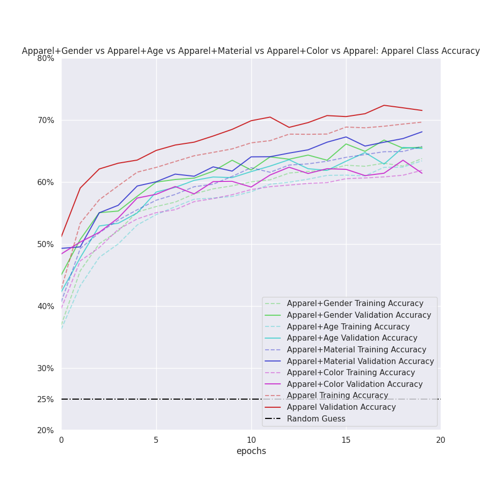
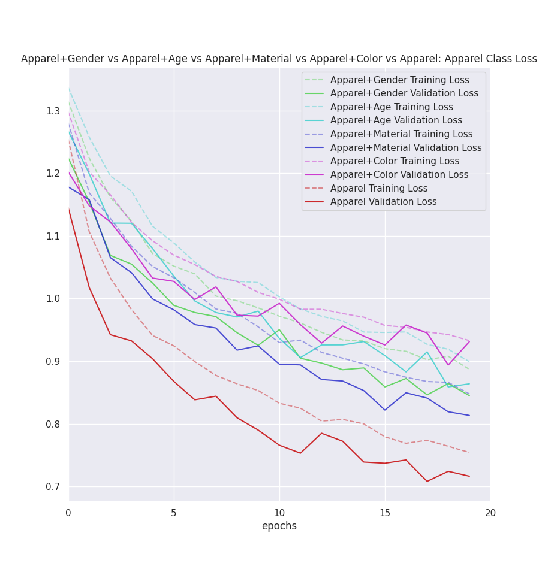

# ComputerVisionMFGM

A classifier model using Convolutional Neural Networks.
It's trained on the [iMaterialist Challenge at FGVC 2017](https://www.kaggle.com/c/imaterialist-challenge-FGVC2017) dataset and mainly classifies if an image is a dress, shoe, pants, or outerwear.
It was written for a university group project.

In order to run, it requires:
- `Python 3.10`
- `numpy`
- `pandas`
- `keras`/`tensorflow`
- `scipy`

The `mfgm_plot.py` functions require `matplotlib`, `scikit-learn` and `seaborn`.

## Execution

If you already have the images of the aforementioned dataset, please place them in the folders `train_images` and `validation_images`, inside the root folder of this project. Otherwise, images will be attempted to be downloaded from the internet, mainly by using the `mfgm_imaterialist.py` script and the `save_image_file(...)` function inside it.

A model can be trained, and plots be made, by either running the `Run.py` script or the `Run.ipynb` notebook (recommended).

## Results

The model achieves up to ~70% accuracy on the task.

